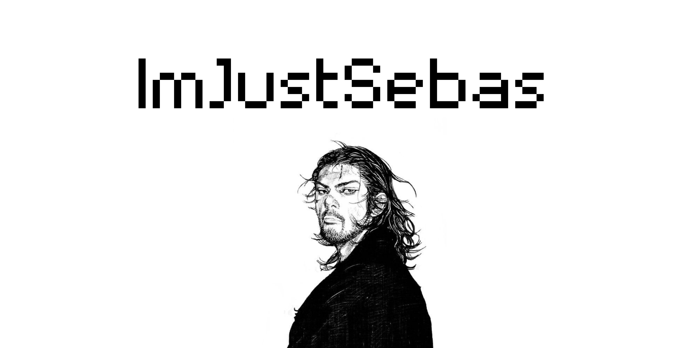
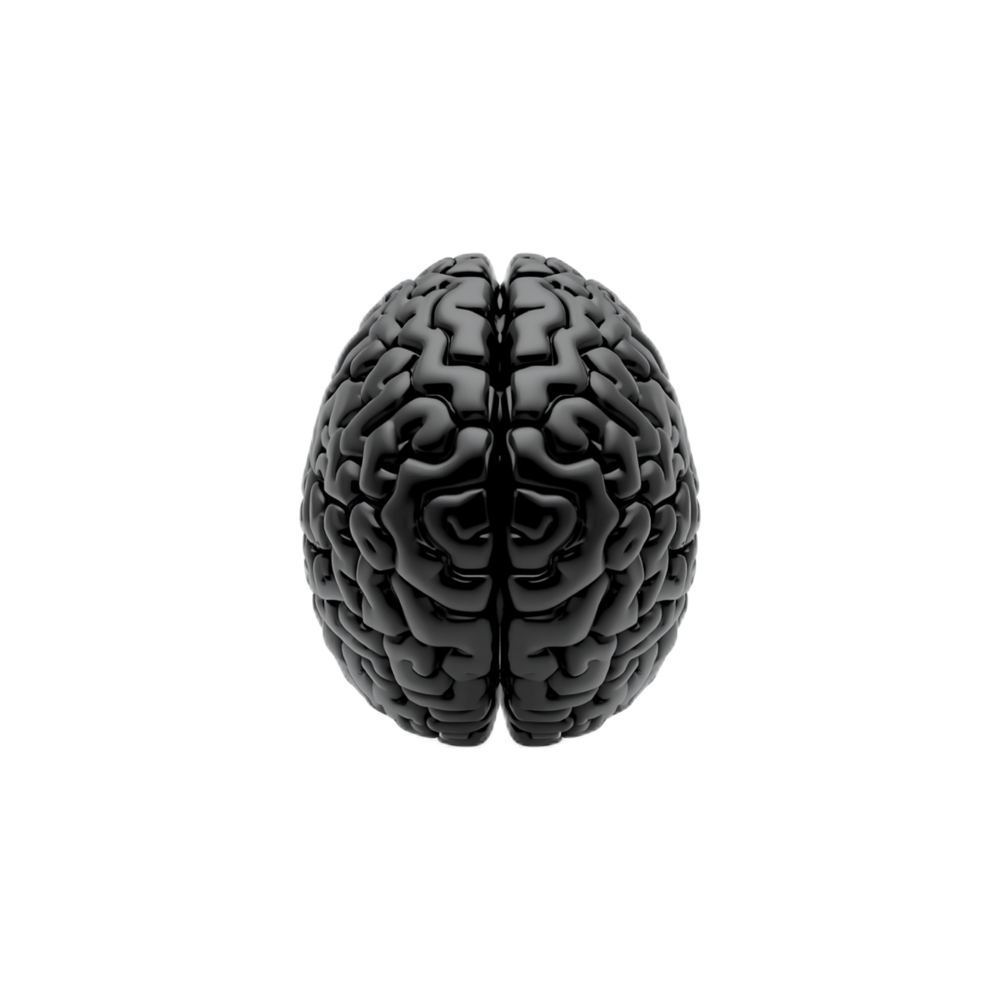

  

  
  &nbsp;&nbsp;&nbsp;
  

 

<table>
<tr>
<td width="62%" valign="middle">

<h2>About Me</h2>

I work from a multidisciplinary and systems-oriented mindset, with a strong interest in understanding how interconnected technologies behave, scale and interact under real-world constraints. My work is centered around technically demanding problems that require analytical depth, precision and strong engineering foundations.

I have participated in projects ranging from personal research initiatives to collaborations with startups, private companies and governmental entities, with experience in cybersecurity, cryptographic protection systems, infrastructure and systems architecture, embedded systems, data analysis environments and web development.

One of my most ambitious personal projects involved the development of a functional neural-controlled prosthesis for people with paralysis, combining Arduino, Python and C to process and translate neural signals into mechanical interaction.

</td>

<td width="38%" align="center" valign="middle">

</td>
</tr>
</table>

---

<h2>Terminal Snapshot</h2>

<pre>
$ whoami
> ImJustSebas — electromechanical engineer & neuro-tech enthusiast

$ projects --latest
> Neural-controlled prosthesis (Arduino + Python + C)

$ skills --level advanced
> C, Python, Bash, Embedded Systems, Cryptography, RTOS

$ status
> Currently learning: Real-time OS & Neuromorphic computing
</pre>

---

<h2>Areas of Interest</h2>

Low-level development • Terminal-based workflows • Systems architecture • Infrastructure design • Cybersecurity • Defensive systems • Technical documentation analysis • Embedded systems • Hardware interaction • Performance optimization • Reliability engineering • Complex problem solving

---

<h2>Technologies & Tools</h2>

<h3>Programming Languages</h3>

Python • C • C++ • Java • JavaScript • PHP • SQL • Bash • MATLAB

<h3>Technologies & Platforms</h3>

Linux • Node.js • Arduino • Git • MySQL • REST APIs • Embedded Systems

<h3>Engineering & Design</h3>

AutoCAD • Technical Systems Design • Hardware/Software Integration

---

<h2>Current Studies</h2>

Electromechanical Engineering — University of Costa Rica
 
Neurology Studies — University of Pennsylvania

 

<table>
<tr>

<td width="60%" align="center">

</td>

<td width="40%" align="center">

</td>

</tr>
</table>

---

<h2>Beyond Engineering</h2>

Outside of software and engineering, I dedicate time to continuous learning across scientific disciplines, physical training, language learning and music composition through guitar and violin.

Most of my technical background, including programming and systems design, has been developed through self-directed learning driven by curiosity, discipline and long-term technical exploration.

##Zenodo Profile

  

  
  &nbsp;&nbsp;&nbsp;
  
    
  <code>uptime: 7 years of self-directed learning | load average: creative, analytical, persistent</code>

